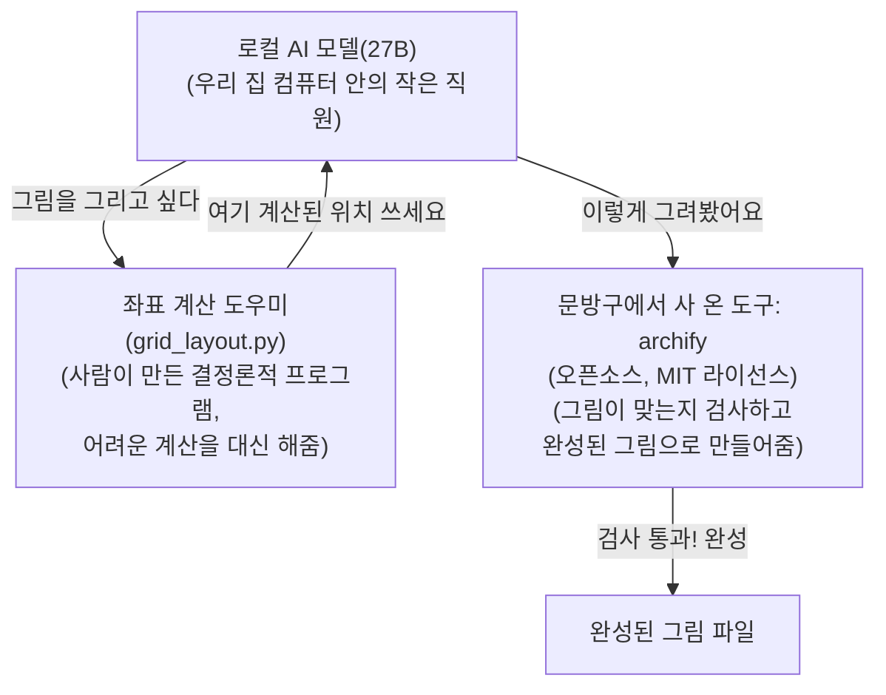

우리 집 컴퓨터 한 대에서 돌아가는 작은 AI가 있다. 이 AI한테 "우리 프로젝트가 어떻게 생겼는지 그림으로 그려봐"라고 시켰더니, 여섯 가지 방식으로 시켜봐도 매번 똑같이 실패했다. 오늘은 그 이야기다.

## McAI란? 인터넷 없이 로컬 컴퓨터에서만 돌아가는 AI 프로젝트

McAI는 "인터넷에 있는 거대한 AI(예: ChatGPT 같은 것)에 의존하지 않고, 내 컴퓨터 안에서만 돌아가는 작은 AI로 실제 개발 작업을 시켜보자"는 프로젝트다.

비유하자면 이렇다: 큰 AI를 쓰는 건 항상 전문 업체에 외주를 주는 것과 비슷하다. 빠르고 편하지만 매번 돈이 나가고, 인터넷이 끊기면 아무것도 못 한다. McAI는 반대로 "우리 집 안에 작은 직원을 하나 키워서, 웬만한 일은 그 직원이 알아서 하게 만들자"는 시도다. 그 직원이 바로 내 컴퓨터에서 돌아가는 AI 모델이고, 지금 이 실험은 "그 직원이 그림 그리는 일도 할 수 있나?"를 테스트한 것이다.

## archify란? AI가 그린 다이어그램을 검증까지 해주는 오픈소스 도구

우리가 쓴 도구의 이름은 archify다(정확한 이름은 `tt-a1i/archify`, 인터넷에 무료로 공개된 오픈소스 프로그램). AI 비서한테 나중에 설치해서 쓰게 해주는 부가 기능이라는 뜻으로 "에이전트 스킬(Agent Skill)"이라고 부르는 형태로 배포된다 — 쉽게 말해, AI에게 쥐여 주는 "그림 그리기 전용 도구 세트"다.

이 도구가 특별한 이유는 그림을 그냥 그려주기만 하는 게 아니라 **결과물을 스스로 검사한다**는 점이다. AI가 "이렇게 그려줘"라는 내용을 정해진 양식의 데이터 파일(타입 JSON 중간표현, Typed JSON IR — 한마디로 "그림 설계도"라고 생각하면 된다)로 적으면, archify에 들어 있는 검사 프로그램(검증기, validator)이 그 설계도를 하나하나 확인한다. 양식이 맞는지, 박스들이 서로 겹치지 않는지, 화살표가 글자를 가리지 않는지까지 전부 통과해야만 진짜 그림 파일로 완성해준다. 검사를 통과하지 못하면 어디가 왜 잘못됐는지 구체적으로 알려주고, 완성된 그림으로 바꿔주지 않는다.

archify는 그림 종류를 다섯 가지로 나눠서 다룬다 — 아래 표로 정리했다.

| 그림 종류 | 뭘 그릴 때 쓰는가 |
|---|---|
| 아키텍처(Architecture) | 프로그램의 전체 구성 요소와 경계(오늘 이야기에서 우리가 쓴 종류) |
| 워크플로(Workflow) | 일이 처리되는 순서, 승인 절차 |
| 시퀀스(Sequence) | 프로그램들끼리 주고받는 요청과 응답의 순서 |
| 데이터 흐름(Data Flow) | 정보가 어디서 와서 어디로 흘러가는지 |
| 생명주기(Lifecycle) | 하나의 작업이 시작부터 끝날 때까지 거치는 상태 변화 |

완성된 결과물은 인터넷 연결 없이도 그 파일 하나만 더블클릭하면 바로 열리는 HTML 파일 한 개다. 가격은 무료이고(MIT 라이선스 — 개인적으로도 회사에서도 자유롭게 써도 된다는 뜻), McAI는 이걸 직접 만들지 않고 그대로 가져다 쓰고 있다.

## archify는 왜 자동 배치 대신 AI 판단에 맡겼나

여기서 오늘 이야기의 핵심 배경이 나온다. 보통 "글자로 그림을 정의하면 프로그램이 알아서 그려주는" 다른 도구들은 박스를 어디에 놓을지를 컴퓨터 계산 규칙(자동 배치 엔진)에 통째로 맡긴다. 반면 archify를 만든 사람은 일부러 그렇게 만들지 않았다 — "어떤 걸 위에 놓을지, 어떤 흐름을 강조할지는 자동 계산이 아니라 AI(에이전트)가 직접 판단해야 한다"는 철학으로 설계했다.

그래서 archify에는 "격자 모드"(모눈종이 배치 방식, grid layout mode)라는 기능이 있다 — 사람이 할 일은 "이 박스는 몇 번째 줄, 몇 번째 칸"이라는 아주 간단한 숫자만 정해주는 것뿐이고, 나머지 정확한 위치 계산과 화살표 연결은 도구가 대신 해준다. 다만 이 기능은 **AI가 스스로 골라서 써야만** 작동한다 — 누가 대신 켜주지 않는다. 바로 이 지점에서 우리가 겪은 문제가 시작됐다.

## 실험 환경: M1 Max 로컬 AI(27B)로 6가지 조합 테스트

- **컴퓨터**: 애플 M1 Max 맥, 인터넷 없이도 혼자 돌아가는 로컬 컴퓨터(온디바이스, on-device) 한 대
- **AI 모델**: 오늘 이야기의 주인공은 McAI 안에서 가장 큰 "27B"(파라미터 270억 개짜리) 모델이다. 이 모델을 세 가지 "생각 모드"(사고모드, thinking mode: 생각을 아예 안 하는 OFF, 조금 생각하는 LOW, 많이 생각하는 MEDIUM)와 두 가지 "실행 방식"(추론 엔진, inference engine: MTPLX, GGUF)으로 바꿔가며 — 3×2 = 총 6가지 조합으로 똑같은 실험을 반복했다
- **시킨 일**: "우리 프로젝트 구조를 archify로 그려줘" (아키텍처 종류 그림)

## 27B AI가 archify 격자 모드를 6번 다 안 쓴 진짜 이유

archify의 격자 모드는 비유하자면 자를 직접 깎아 만드는 대신 문방구에서 사 온 자와 같다 — 있는 걸 그대로 갖다 쓰기만 하면 되는데도, 사람이 보기엔 네모 박스 몇 개 그리고 화살표로 잇는 게 별거 아닌 것 같지만 AI 입장에서는 각 박스를 화면의 정확히 어느 위치(가로·세로 몇 픽셀인지, 즉 좌표, coordinate)에 놓을지 일일이 숫자로 계산해야 한다. 이게 생각보다 어렵다 — 마치 눈을 감고 종이 위에 자 없이 정확히 줄 맞춰 글씨를 쓰라는 것과 비슷하다.

**그런데 AI는 격자 모드를 한 번도 쓰지 않았다.** 아래 표는 6가지 조합(사고모드 3가지 × 실행 엔진 2가지) 전부의 결과다 — 전부 똑같이, 자를 쓰는 대신 매번 픽셀 좌표를 스스로 계산하려다 실패했다.

| 사고 모드 (Thinking Mode) | 실행 엔진 (Engine) | 결과 |
|---|---|---|
| 사고 끄기 (OFF) | MTPLX | 실패 — 좌표 직접 계산 시도 |
| 사고 끄기 (OFF) | GGUF | 실패 — 좌표 직접 계산 시도 |
| 조금 생각 (LOW) | MTPLX | 실패 — 좌표 직접 계산 시도 |
| 조금 생각 (LOW) | GGUF | 실패 — 좌표 직접 계산 시도 |
| 많이 생각 (MEDIUM) | MTPLX | 실패 — 좌표 직접 계산 시도 |
| 많이 생각 (MEDIUM) | GGUF | 실패 — 좌표 직접 계산 시도 |

바로 옆에 사용법 설명서(가이드 문서)와 예시 14개가 있었는데도, 6번 다 한 번도 열어보지 않은 것이다.

## AI 대신 파이썬 코드가 좌표를 계산하게 바꾼 방법

**AI에게 계산을 맡기는 대신, 계산 자체를 사람이 만든 프로그램이 대신 해주기로 했다.** `grid_layout.py`라는 작은 프로그램(사람이 미리 정확히 짜 놓아서 항상 같은 답을 내는 결정론적 프로그램, deterministic helper)을 새로 만들어서, "몇 번째 줄, 몇 번째 칸"만 넣으면 정확한 좌표를 자동으로 뽑아주고, 그 답을 AI에게 그대로 건네주는 방식으로 바꿨다. AI는 이제 어려운 계산을 할 필요 없이, 이미 계산된 답을 받아쓰기만 하면 된다.

이 경험 때문에 McAI 프로젝트에는 새 원칙이 하나 생겼다: **"AI가 처음 해보는 일이거나 막혔을 때는, 스스로 머리를 쥐어짜기 전에 옆에 있는 설명서부터 찾아보게 하자."**

덤으로 찾은 문제도 하나 있었다: archify의 검사 프로그램이 파일 이름을 확인할 때 특정 이름 패턴만 검사하고 있어서, 다른 이름의 예시 파일들은 검사 자체를 건너뛰고도 "통과"라고 잘못 표시되는 버그가 있었다. 이것도 함께 고쳤다.

## 수정 후 194초 만에 archify 다이어그램 생성 성공

수정한 뒤, 2026년 9월 27일에 "우리 프로젝트 구조를 archify로 그려줘"라는 요청을 다시 시켜봤다. 이번엔 194초(3분 조금 넘는 시간) 만에 완성된 그림 파일(HTML)을 만들어냈고, archify의 최고 등급 검사(9개 검사 항목, 에러 0개·경고 0개 요구)를 전부 통과했다.

## 실제로 완성된 MicroServices 프로젝트 구조도(직접 클릭해서 살펴보기)

이 194초짜리 성공 결과가 바로 지금까지 이야기한 "우리 프로젝트"(McAI의 `MicroServices` 저장소) 실제 구조도다. 예시로 지어낸 그림이 아니라, 실제로 이 프로젝트 안에 들어 있는 서비스 10개(`mc_contracts`, `mc_router`, `mc_watch`, `mc_runtime`, `mc_context`, `mc_explorer`, `mc_resource`, `mc_state`, `mc_crawler`, `mc_source`)를 그대로 담고 있다.

아래는 그 결과물을 스크린샷이 아니라 **진짜 파일 그대로** 옮겨온 것이다 — 박스를 클릭하면 그 서비스와 연결된 다른 서비스들이 강조되고, 화살표를 따라가며 어떤 서비스가 어떤 서비스를 호출하는지도 살펴볼 수 있다. 가운데 있는 `mc_runtime`(로컬 AI 모델을 실제로 돌리는 서비스)으로 대부분의 화살표가 모이는 것도 한눈에 보인다.

<iframe src="/mcai-tech-blog/diagrams/microservices-architecture.html" style="width:100%;height:640px;border:1px solid #3a3a3a;border-radius:8px;" loading="lazy" title="McAI MicroServices 실제 아키텍처 다이어그램(archify로 생성)"></iframe>

화면이 작게 보이면 [다이어그램을 새 탭에서 크게 열기](/mcai-tech-blog/diagrams/microservices-architecture.html)를 눌러서 확인하면 된다.

## AI가 그린 삽화와 정확한 순서도, 이 그림들이 보여주는 것

아래 그림은 방금 설명한 전체 과정을 위에서 아래로 순서대로 정리한 것이다. ① AI가 "그림을 그리고 싶다"고 하면, ② 옆에 있는 "좌표 계산 도우미"(위에서 말한 `grid_layout.py`)가 정확한 위치를 미리 계산해서 건네준다. ③ AI는 그 답을 받아 그림을 그려서 문방구 도구(archify)에게 넘기고, ④ archify가 검사를 통과시키면 완성된 그림 파일이 나온다.

위 순서도가 정확한 설명용 그림이라면, 아래는 같은 흐름을 우리 집 컴퓨터에서 돌아가는 또 다른 로컬 AI(이미지 생성 전용 모델, McAI의 `mc_image`)에게 "이 순서를 그림으로 그려줘"라고 부탁해서 직접 받은 그림이다. 로봇 칩 → 자와 모눈종이 → 도장(검사 통과) → 완성된 사진 순서로, 정확히 같은 4단계를 아이콘으로 표현했다.

이 그림은 정확한 구조도가 아니라 **꾸미기용 삽화**다(위 순서도와 달리 텍스트 라벨은 없다 — 이미지 생성 AI는 아직 글자를 정확히 그리는 걸 잘 못하기 때문에 일부러 뺐다). 정확한 정보는 항상 위의 순서도를, 분위기는 이 그림을 참고하면 된다.

## archify 실패담이 McAI 프로젝트에 남긴 교훈

작은 AI 혼자 힘으로는 "그림 그리기" 같은 새로운 일을 잘 못 했지만, ① 이미 있는 도구를 가져다 쓰고 ② 어려운 부분(좌표 계산)은 AI가 아니라 확실한 프로그램이 대신 처리하게 나누니 결국 해결됐다. 이게 McAI가 "큰 AI 없이도 작은 컴퓨터 한 대로 실제 일을 시켜보자"는 실험에서 매번 배우는 패턴이다 — AI에게 전부를 맡기지 않고, AI가 잘하는 부분과 프로그램이 잘하는 부분을 나누는 것.

---
*이 글에서 소개한 archify는 McAI가 만든 도구가 아니라, 오픈소스로 공개된 외부 도구다. 더 자세한 내용은 [공식 프로젝트 페이지](https://tt-a1i.github.io/archify/)와 [GitHub 저장소](https://github.com/tt-a1i/archify)에서 볼 수 있다.*
