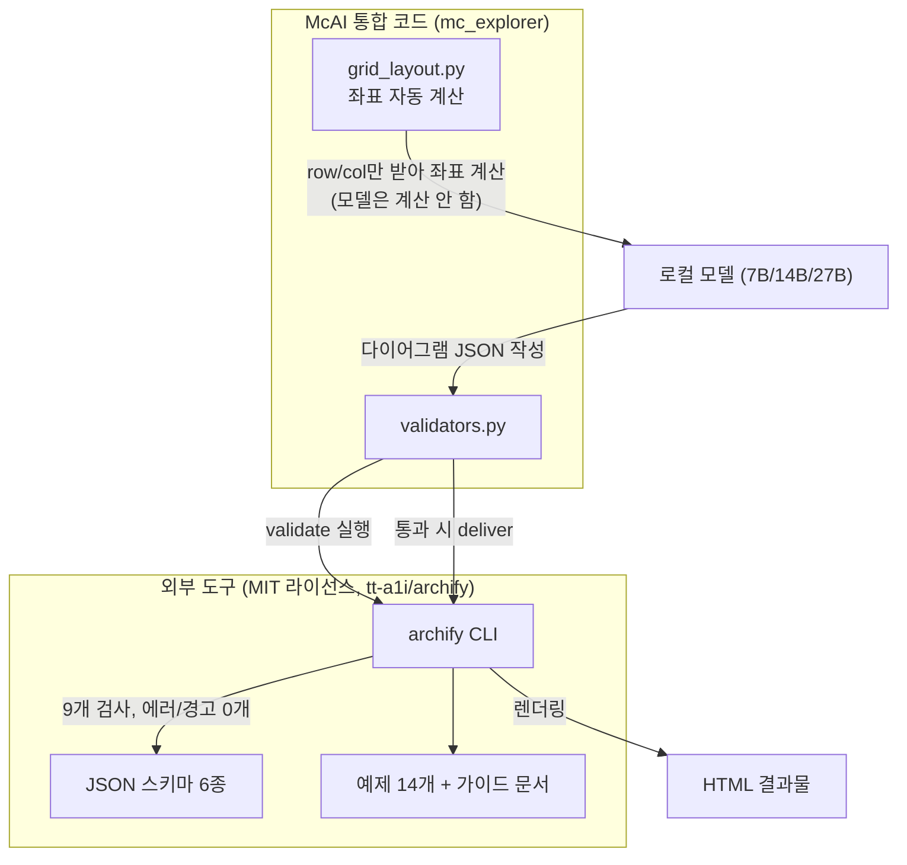

## archify가 무엇인가
- archify는 **외부 오픈소스 도구**로, McAI에서는 이를 "툴박스"로 가져다 사용한다. 그 역할은 소프트웨어 아키텍처/워크플로우 다이어그램을 JSON 파일로 작성한 뒤, 이를 검증하고 HTML로 그려주는 도구다.

## 어떻게 쓰이나
- 다이어그램 종류는 architecture, workflow, sequence, dataflow, lifecycle 등 5가지가 있다.
- 검증 명령은 `node bin/archify.mjs validate <종류> <경로> --quality showcase`로, "showcase" 등급을 통과하기 위해서는 9개 검사 항목 중 에러 0개, 경고 0개가 필요하다.
- 검증이 통과하면 `deliver` 명령으로 HTML 결과물을 생성한다.

## 진짜 있었던 실패담
- archify의 architecture 다이어그램 스키마에 `layout.mode="grid"`라는 기능이 있는데, 이 기능을 사용하면 좌표를 일일이 계산하지 않고 row/col만 지정하면 도구가 알아서 위치와 연결선을 계산해준다.
- 그런데 실제로 돌려보니, 27B급 모델이 **사고모드 OFF·LOW·MEDIUM 세 가지, MTPLX·GGUF 두 엔진 전부에서 똑같이** 이 기능을 쓰지 않고 매번 픽셀 좌표를 손으로 계산하려다 실패했다. 총 6가지 조합을 전부 시도했는데 결과가 하나같이 똑같았다 — 바로 옆에 스키마와 예제 14개, 가이드 문서(SKILL.md)까지 다 있었는데도 한 번도 참고하지 않은 것이다.

## 해결책과 실제 적용 사례
- 해결책은 grid_layout.py라는 헬퍼를 새로 만드는 것이었다. 이를 통해 row/col 배치를 자동으로 계산해 모델에게 "이미 계산된 답"을 제공하는 방식으로 변경되었다.
- 그리고 archify의 예제 파일들이 `.sequence.json`으로 끝나는데, McAI 코드가 처음에는 `.archify.json`으로 끝나는 파일만 검사해 예제 파일들을 검증 과정에서 빠뜨리는 버그가 있었다.

## 성공 사례
- 2026년 9월 27일, "tt-a1i/archify를 조사하고 현재 프로젝트 구조를 archify로 그려라"는 미션이 27B급 모델에서 194.02초 만에 성공, MicroServices.archify.json과 MicroServices.html을 만들어냈다.

## 전체 구조

