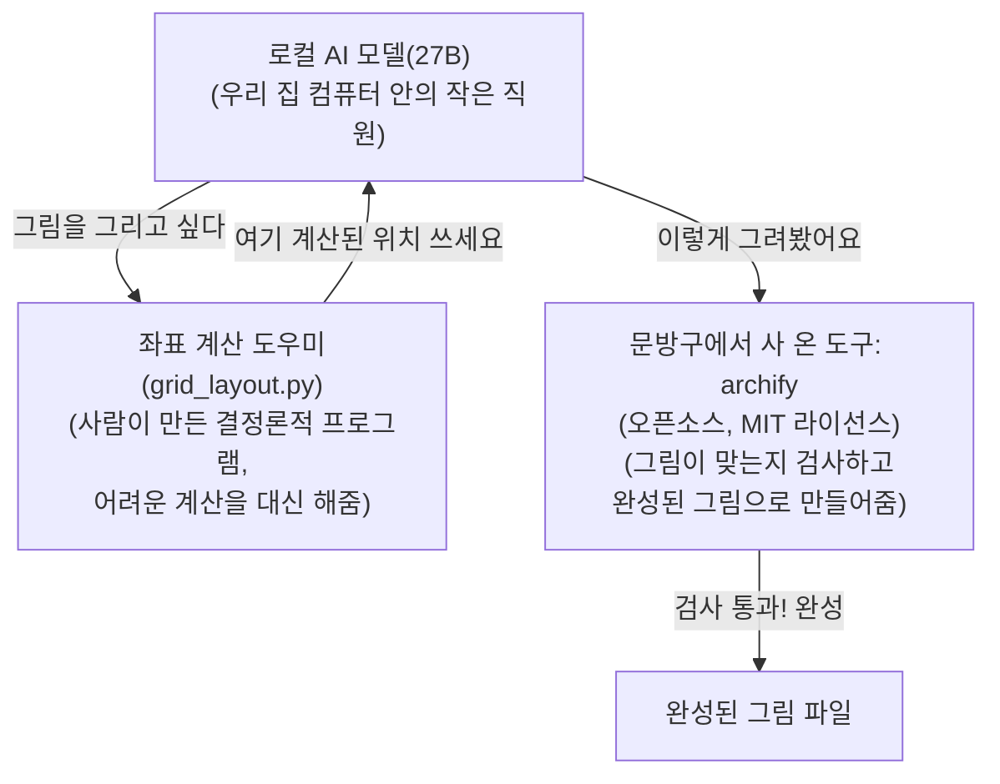

우리 집 컴퓨터 한 대에서 돌아가는 작은 AI가 있다. 이 AI한테 "우리 프로젝트가 어떻게 생겼는지 그림으로 그려봐"라고 시켰더니, 세 번 다른 방식으로 시켜봐도 똑같은 방식으로 실패했다. 오늘은 그 이야기다.

## McAI가 뭐길래 이런 실험을 하나

McAI는 "인터넷에 있는 거대한 AI(예: ChatGPT 같은 것)에 의존하지 않고, 내 컴퓨터 안에서만 돌아가는 작은 AI로 실제 개발 작업을 시켜보자"는 프로젝트다.

비유하자면 이렇다: 큰 AI를 쓰는 건 항상 전문 업체에 외주를 주는 것과 비슷하다. 빠르고 편하지만 매번 돈이 나가고, 인터넷이 끊기면 아무것도 못 한다. McAI는 반대로 "우리 집 안에 작은 직원을 하나 키워서, 웬만한 일은 그 직원이 알아서 하게 만들자"는 시도다. 그 직원이 바로 내 컴퓨터에서 돌아가는 AI 모델이고, 지금 이 실험은 "그 직원이 그림 그리는 일도 할 수 있나?"를 테스트한 것이다.

## 실험 환경: 무엇으로, 어떻게 돌렸나

- **컴퓨터**: 애플 M1 Max 맥, 인터넷 없이도 혼자 돌아가는 로컬 컴퓨터(온디바이스, on-device) 한 대
- **AI 모델**: 오늘 이야기의 주인공은 McAI 안에서 가장 큰 "27B"(파라미터 270억 개짜리) 모델이다. 이 모델을 세 가지 "생각 모드"(사고모드, thinking mode: 생각을 아예 안 하는 OFF, 조금 생각하는 LOW, 많이 생각하는 MEDIUM)와 두 가지 "실행 방식"(추론 엔진, inference engine: MTPLX, GGUF)으로 바꿔가며 — 3×2 = 총 6가지 조합으로 똑같은 실험을 반복했다
- **시킨 일**: "우리 프로젝트 구조를 그림(다이어그램)으로 그려줘"

## 왜 "그림"이 어려운 일인가

사람이 보기엔 네모 박스 몇 개 그리고 화살표로 잇는 게 별거 아닌 것 같지만, AI 입장에서는 각 박스를 화면의 정확히 어느 위치(가로·세로 몇 픽셀인지, 즉 좌표, coordinate)에 놓을지 일일이 숫자로 계산해야 한다. 이게 생각보다 어렵다 — 마치 눈을 감고 종이 위에 자 없이 정확히 줄 맞춰 글씨를 쓰라는 것과 비슷하다.

## 이미 "자"가 있었는데, AI가 그걸 안 썼다

다행히 우리는 archify라는 도구를 쓰고 있었다. 이건 McAI가 직접 만든 게 아니라, 인터넷에 이미 공개돼 있는 무료 오픈소스 도구(누구나 가져다 써도 되는 공개 라이선스인 MIT 라이선스, `tt-a1i/archify`라는 이름)를 가져다 쓰는 것이다 — 비유하자면 자를 직접 깎아 만드는 대신 문방구에서 사 온 셈이다.

이 도구에는 "격자 모드"(모눈종이 배치 방식, grid layout mode)라는 기능이 있다. 쉽게 말해 모눈종이 같은 것이다 — "이 박스는 몇 번째 줄, 몇 번째 칸에 놓아줘"라고만 말하면, 정확한 픽셀 위치와 화살표까지 도구가 알아서 계산해준다. 사람이 할 일은 "1번째 줄 2번째 칸" 같은 아주 간단한 숫자만 정해주는 것뿐이다.

**그런데 AI는 이 모눈종이 기능을 한 번도 쓰지 않았다.** 아래 표는 6가지 조합(사고모드 3가지 × 실행 엔진 2가지) 전부의 결과다 — 전부 똑같이, 모눈종이를 쓰는 대신 매번 픽셀 좌표를 스스로 계산하려다 실패했다.

| 사고 모드 (Thinking Mode) | 실행 엔진 (Engine) | 결과 |
|---|---|---|
| 사고 끄기 (OFF) | MTPLX | 실패 — 좌표 직접 계산 시도 |
| 사고 끄기 (OFF) | GGUF | 실패 — 좌표 직접 계산 시도 |
| 조금 생각 (LOW) | MTPLX | 실패 — 좌표 직접 계산 시도 |
| 조금 생각 (LOW) | GGUF | 실패 — 좌표 직접 계산 시도 |
| 많이 생각 (MEDIUM) | MTPLX | 실패 — 좌표 직접 계산 시도 |
| 많이 생각 (MEDIUM) | GGUF | 실패 — 좌표 직접 계산 시도 |

바로 옆에 사용법 설명서(가이드 문서)와 예시 14개가 있었는데도, 6번 다 한 번도 열어보지 않은 것이다.

## 그래서 어떻게 고쳤나

**AI에게 계산을 맡기는 대신, 계산 자체를 사람이 만든 프로그램이 대신 해주기로 했다.** `grid_layout.py`라는 작은 프로그램(사람이 미리 정확히 짜 놓아서 항상 같은 답을 내는 결정론적 프로그램, deterministic helper)을 새로 만들어서, "몇 번째 줄, 몇 번째 칸"만 넣으면 정확한 좌표를 자동으로 뽑아주고, 그 답을 AI에게 그대로 건네주는 방식으로 바꿨다. AI는 이제 어려운 계산을 할 필요 없이, 이미 계산된 답을 받아쓰기만 하면 된다.

이 경험 때문에 McAI 프로젝트에는 새 원칙이 하나 생겼다: **"AI가 처음 해보는 일이거나 막혔을 때는, 스스로 머리를 쥐어짜기 전에 옆에 있는 설명서부터 찾아보게 하자."**

덤으로 찾은 문제도 하나 있었다: 검사 프로그램이 파일 이름을 확인할 때 특정 이름 패턴만 검사하고 있어서, 다른 이름의 예시 파일들은 검사 자체를 건너뛰고도 "통과"라고 잘못 표시되는 버그가 있었다. 이것도 함께 고쳤다.

## 결국 성공은 했다

수정한 뒤, 2026년 9월 27일에 "우리 프로젝트 구조를 archify로 그려줘"라는 요청을 다시 시켜봤다. 이번엔 194초(3분 조금 넘는 시간) 만에 성공적으로 그림 파일을 만들어냈다.

## 이 그림이 뭘 보여주는가

아래 그림은 방금 설명한 전체 과정을 위에서 아래로 순서대로 정리한 것이다. ① AI가 "그림을 그리고 싶다"고 하면, ② 옆에 있는 "좌표 계산 도우미"(위에서 말한 `grid_layout.py`)가 정확한 위치를 미리 계산해서 건네준다. ③ AI는 그 답을 받아 그림을 그려서 문방구 도구(archify)에게 넘기고, ④ archify가 검사를 통과시키면 완성된 그림 파일이 나온다.

## 정리하면

작은 AI 혼자 힘으로는 "그림 그리기" 같은 새로운 일을 잘 못 했지만, ① 이미 있는 도구를 가져다 쓰고 ② 어려운 부분(좌표 계산)은 AI가 아니라 확실한 프로그램이 대신 처리하게 나누니 결국 해결됐다. 이게 McAI가 "큰 AI 없이도 작은 컴퓨터 한 대로 실제 일을 시켜보자"는 실험에서 매번 배우는 패턴이다 — AI에게 전부를 맡기지 않고, AI가 잘하는 부분과 프로그램이 잘하는 부분을 나누는 것.
